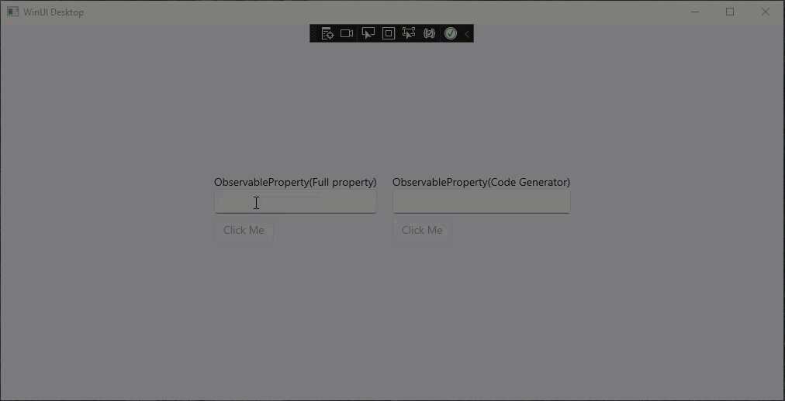

# Sample  WinUI  CanExecute  logic usage test

Demonstrate a simple way of using CanExecute logic to change the UI elements IsEnabled state automatically based on other elements property change event



Dependencies:

- CommunityToolkit.Mvvm  Version 8.0.0-preview3
- CommunityToolkit.WinUI.UI  Version 7.1.2
- CommunityToolkit.WinUI.UI.Controls Version 7.1.2
- Microsoft.Extensions.DependencyInjection  Version 6.0.0
- Microsoft.WindowsAppSDK  Version 1.0.3

Notes:

* This is a WinUI project and uses Windows App SDK
* The CommunityToolkit.Mvvm 8 preview3 is used to have the CanExecute parameter in ICommand attribute


How to define CanExecute:

```c#
private bool ButtonClickCanExecute()
{
  //can execute logic
  return MyText.Length>0;
 }

[ICommand(CanExecute = "ButtonClickCanExecute")]
public async Task ButtonClickAsync()
{

}	
```


How to trigger CanExecute on ProperyChanged event:

```c#
private string _myText = "";
public string MyText
{
    get => _myText;
    set
    {
        if (SetProperty(ref _myText, value))
        {
            OnPropertyChanged(nameof(MyText));
            //this is the key code to have the CanExecute logic checked on PropertyChanged event
            ButtonClickCommand.NotifyCanExecuteChanged();
        }
    }
}
```


